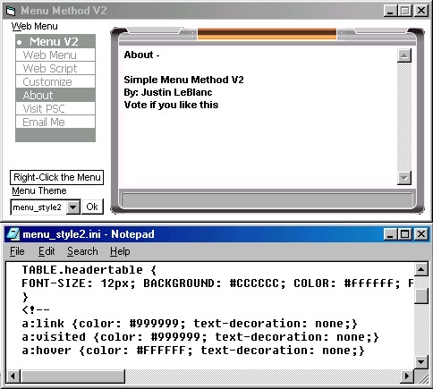



## Menu Method V2 Using Web Scripting

### Description

This is an update to the first project. This example shows how to use an external source for the Menu. Like setting up themes for your app. This code is for creating a sweet custom looking navigation method on your project using basic HTML and CSS web scripting. Executing the 'document.write' function write to the Microsoft Web Browser Control. Creating a menu this way allows it to be sort of dynamic allowing it to have many customizations.
 
### More Info
 

             |
---                |---
**Submitted On**   |2004-05-14 06:38:36
**By**             |[Justin LeBlanc](https://github.com/Planet-Source-Code/PSCIndex/blob/master/ByAuthor/justin-leblanc.md)
**Level**          |Intermediate
**User Rating**    |4.6 (41 globes from 9 users)
**Compatibility**  |VB 5\.0, VB 6\.0
**Category**       |[Custom Controls/ Forms/  Menus](https://github.com/Planet-Source-Code/PSCIndex/blob/master/ByCategory/custom-controls-forms-menus__1-4.md)
**World**          |[Visual Basic](https://github.com/Planet-Source-Code/PSCIndex/blob/master/ByWorld/visual-basic.md)
**Archive File**   |[Menu\_Metho1745755152004\.zip](https://github.com/Planet-Source-Code/justin-leblanc-menu-method-v2-using-web-scripting__1-53802/archive/master.zip)

